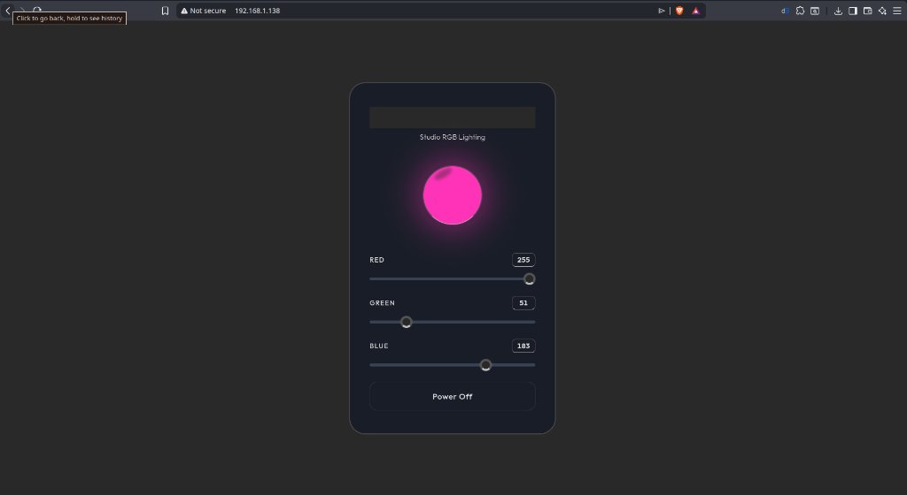

# Chroma Control — ESP32 Wi-Fi RGB Controller

A standalone Wi-Fi RGB LED controller running on the ESP32-S3 using the ESP-IDF framework. It hosts a self-contained web dashboard that lets you dial in any color on a WS2812B LED from your phone or laptop — no app install, no cloud, no internet required.



---

## Features

- **On-device web UI** — Dark-themed glassmorphic dashboard with live color preview orb and per-channel sliders.
- **mDNS discovery** — Access the controller at `http://chroma.local` without needing to know its IP.
- **Dedicated LED task** — Color updates run on a separate FreeRTOS task so the HTTP server never blocks.
- **Hardware kill switch** — Press the onboard BOOT button to instantly turn the LED off.
- **Persistent Wi-Fi** — Infinite auto-reconnect; the device will recover on its own after a router reboot or signal drop.
- **No hardcoded credentials** — Wi-Fi SSID and password are configured through `idf.py menuconfig`.

---

## Hardware

### What you need

| # | Component | Notes |
|---|-----------|-------|
| 1 | ESP32-S3 dev board | Any variant with USB-C works. Tested on ESP32-S3 N16R8. |
| 2 | WS2812B LED (or strip) | Single onboard LED or external strip. |
| 3 | 5V power supply from pc or own supply unit | Only needed for strips longer than ~10 LEDs. |

### Wiring

| WS2812B Pin | ESP32 Pin | Notes |
|-------------|-----------|-------|
| VCC (5V)    | `5V` / `VIN` | Use external PSU for long strips. |
| GND         | `GND`     | Common ground with ESP32 if using external power. |
| DIN         | `GPIO 48` | Change `RGB_LED_GPIO` in `main.c` if your board differs. |

> The BOOT button on `GPIO 0` is already wired on most dev boards — no extra connections needed.

---

## Getting Started

### Prerequisites

- [ESP-IDF v5.x](https://docs.espressif.com/projects/esp-idf/en/latest/esp32/get-started/) installed and sourced.

### 1. Clone

```bash
git clone https://github.com/Bouch2004/WIFI-LED.git
cd WIFI-LED
```

### 2. Set your Wi-Fi credentials

```bash
idf.py menuconfig
```

Navigate to **RGB Web Controller Configuration** and fill in your SSID and password.

### 3. Build, flash, and monitor

```bash
idf.py build flash monitor
```

The serial output will show the assigned IP:

```
I (1542) RGB_DASHBOARD: Got IP: 192.168.1.138 — open this in your browser!
I (1543) RGB_DASHBOARD: mDNS initialized. You can now access http://chroma.local
```

### 4. Open the dashboard

On any device connected to the same Wi-Fi network, open:

```
http://chroma.local
```

Or use the IP address printed in the serial log.

### Standalone mode

Once flashed, the ESP32 does not need a PC. Plug it into any USB charger (phone charger works fine) and it will boot, connect to Wi-Fi, and start the web server automatically.

---

## Project Structure

```
├── main/
│   ├── main.c               # Application entry point, Wi-Fi, HTTP server, LED task
│   ├── Kconfig.projbuild     # Menuconfig definitions for Wi-Fi credentials
│   └── idf_component.yml    # Component dependencies (led_strip, mdns)
├── CMakeLists.txt            # Top-level build config
```

---

## Tech Stack

- **Framework:** ESP-IDF v5.3
- **Language:** C (gnu17)
- **RTOS:** FreeRTOS (dual-core, SMP)
- **LED driver:** RMT peripheral via `espressif/led_strip`
- **Networking:** lwIP, ESP HTTP Server, mDNS
- **Target:** ESP32-S3

---

## License

MIT
